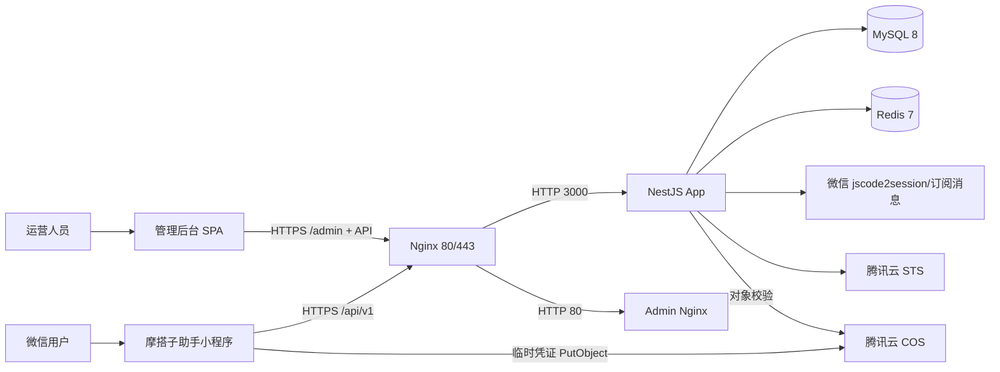

# 摩搭子助手 V2.2 项目交接说明

> 交接基线日期：2026-08-20  
> 当前版本：V2.2  
> 说明：服务器、域名、证书、账号和联系人均使用占位符，交接时由负责人在受控渠道填写。

## 一、项目概述

### 1.1 一句话介绍

摩搭子助手是一款面向摩托车骑行用户的微信小程序，用于发现和发起同行约骑、录入与分享骑行路线、查询骑行安全知识并管理个人骑行资料。

### 1.2 核心功能

- 同行助手：同城同行发现、位置距离筛选、发起、报名、取消、发起人转让、状态自动流转。
- 路线：官方精选路线、用户路线录入、公开/私密、收藏、评论、关联同行。
- 骑行安全手册：摩托车法规索引、事故处理指南、安全骑行倡议、安全协议。
- 助手通知：站内未读消息和微信订阅消息。
- 个人中心：资料、联系方式可见性、我的同行、我的路线、通知及隐私设置。
- 管理后台：用户、同行、官方路线、法规、安全内容、功能开关和审计管理。

### 1.3 目标用户

- 希望寻找同城骑友、组织短途或长途同行的摩托车用户。
- 希望沉淀、分享和发现骑行路线的用户。
- 需要获取官方法规索引和基础安全知识的骑行用户。
- 负责路线、安全内容、法规和用户治理的运营/管理员。

### 1.4 V2.2 边界

- 正式小程序固定为“同行助手、路线、助手通知、我的”四个 Tab。
- 活动和论坛已退出 V2.2 运行时，历史数据库表暂作归档保留。
- API 版本保持 `/api/v1`。
- 标准生产部署为 Docker Compose，不以 PM2 作为主方案。

## 二、技术栈清单

### 2.1 小程序前端

| 技术 | 当前版本/范围 | 用途 |
| --- | --- | --- |
| Node.js | 20.x 建议 | 构建环境 |
| Taro | 4.2.0 | 微信小程序构建与跨端抽象 |
| React / React DOM | 18.x | 组件和页面 |
| TypeScript | 5.4.x | 静态类型 |
| Zustand | 5.0.x | 用户、同行、通知等状态 |
| NutUI React Taro | 3.0.x | UI 组件 |
| Axios | 1.x | 请求层基础依赖 |
| cos-wx-sdk-v5 | 1.8.x | 小程序直传腾讯云 COS |
| Sass | 1.75.x | SCSS 样式 |

### 2.2 后端

| 技术 | 当前版本/范围 | 用途 |
| --- | --- | --- |
| Node.js | 20.x | 构建与运行 |
| NestJS | 10.x | API 框架与模块化组织 |
| TypeScript | 5.x | 服务端语言 |
| Prisma / Prisma Client | 5.x | MySQL ORM 与迁移 |
| MySQL | 8.0 | 业务主数据库 |
| Redis / ioredis | Redis 7 / ioredis 5 | 缓存、Token 黑名单、GEO、锁和计数 |
| Jest / Supertest | Jest 29 / Supertest 6 | 单元、集成与 E2E 测试 |
| 腾讯云 STS/COS SDK | 当前 package-lock 锁定版本 | 临时凭证和对象校验 |

### 2.3 管理后台

| 技术 | 当前版本/范围 |
| --- | --- |
| React / React DOM | 19.2.x |
| Ant Design | 6.5.x |
| React Router | 7.18.x |
| Zustand | 5.0.x |
| Vite | 8.1.x |
| TypeScript | 6.0.x |

### 2.4 基础设施

| 项目 | 说明 |
| --- | --- |
| 云服务器 | 腾讯云 CVM 或兼容 Ubuntu 24.04 主机；实际 IP/配置见第四节占位表 |
| 容器 | Docker Engine + Docker Compose Plugin |
| 网关 | Nginx 1.27 Alpine，统一 80/443 入口 |
| 数据库 | MySQL 8.0 容器，具名卷 `mysql_data` |
| 缓存 | Redis 7 Alpine，AOF 和密码认证，具名卷 `redis_data` |
| 文件 | 腾讯云 COS，当前业务使用公有读、私有写策略；长期密钥仅存后端 |
| 证书 | 腾讯云申请/托管的 SSL 证书，宿主机只读挂载到 Nginx |

## 三、开发环境搭建（从零开始）

### 3.1 代码仓库

| 项目 | 值 |
| --- | --- |
| GitHub SSH | `git@github.com:x328c/x328c.git` |
| 当前交接分支 | `codex/v2.2-release-20260818` |
| 已推送基线 Commit | `6530f26 feat(v2.2): complete production login media rides and routes` |

```bash
git clone git@github.com:x328c/x328c.git jiangxing
cd jiangxing
git switch codex/v2.2-release-20260818
```

仓库如为私有库，接手人需先配置 GitHub SSH Key。不得通过复制 `.git`、生产 `.env.production` 或服务器私钥完成交接。

### 3.2 环境依赖

- Node.js 20.x、npm 10.x。
- Docker Engine 和 Docker Compose Plugin。
- 微信开发者工具稳定版，加入小程序开发/体验成员。
- 本地运行时可使用 Docker MySQL 8、Redis 7，或安装对应服务。
- macOS/Linux 推荐；Windows 建议 WSL2，注意路径和脚本执行权限。

### 3.3 后端启动

```bash
cd backend
npm ci
cp .env.example .env
# 编辑 .env：本地 DATABASE_URL、Redis、JWT、微信/COS 测试配置

npx prisma generate
npx prisma migrate dev
npm run db:seed:dev       # 可选：仅开发库
npm run start:dev
```

验证：

```bash
curl http://localhost:3000/api/v1/health
npm run build
npm test -- --runInBand
```

### 3.4 前端启动

```bash
cd frontend
npm ci

# 本机后端联调，读取 .env.development
npm run dev:weapp:local

# 或构建测试环境
npm run build:weapp:test
```

在微信开发者工具中导入 `frontend/`，确认 AppID 与当前测试小程序一致。开发环境可在工具中关闭合法域名校验；真机和生产必须配置 HTTPS 合法域名，不能依赖该选项。

发布前：

```bash
npm run typecheck
npm run build:weapp
npm run check:bundle
```

### 3.5 管理后台启动

```bash
cd admin
npm ci
npm run dev

# 发布前
npm run lint
npm run build
```

管理后台 API 地址由其请求封装/反向代理配置决定。生产以 `/admin/` 提供页面，以同域 API 访问后端。

### 3.6 数据库初始化与迁移

```bash
cd backend

# 修改 schema 后，在开发库生成迁移
npx prisma migrate dev --name <migration_name>

# 检查 Schema 和生成 Client
npx prisma validate
npx prisma generate

# 测试/生产只部署已提交迁移
npx prisma migrate deploy
npx prisma migrate status
```

当前 Schema 共 20 个顺序迁移，最新迁移为 `20260819100000_link_user_routes_to_rides`。禁止在生产使用 `migrate dev`、`db push` 或手工修改表后不补迁移。

开发播种和 V2.2 数据任务：

```bash
npm run db:seed:dev
npm run db:cleanup:v22:preview
npm run db:import:v22:initiative
```

受控法规清理是高风险永久删除操作，必须按脚本说明先预演、备份、人工确认候选数量；不得把开发环境确认串直接复用到生产。

### 3.7 环境变量

- 前端：`.env.development`、`.env.test`、`.env.production`；核心变量为 `TARO_APP_API_BASE`、`TARO_APP_ENV`、`TARO_APP_ID`。
- 后端本地：从 `.env.example` 复制为 `.env`。
- 后端生产：由 `deploy/scripts/init-production-env.sh` 生成 `.env.production`，权限 `0600`。
- 必填生产外部配置：微信 AppID/AppSecret、COS SecretId/SecretKey/Bucket/Region/访问域名、订阅模板 ID。
- JWT Access、Refresh、Admin 三个密钥必须不同；数据库、Redis 密码不得复用。
- `.env*` 中的真实密钥不进入 Git、文档、截图、工单或聊天记录。

## 四、部署环境说明

### 4.1 生产服务器信息（交接填写）

| 项目 | 值 |
| --- | --- |
| 云厂商/账号 | `<CLOUD_VENDOR_AND_ACCOUNT>` |
| 服务器名称 | `<SERVER_NAME>` |
| 公网 IP | `<PRODUCTION_SERVER_IP>` |
| 内网 IP | `<PRODUCTION_PRIVATE_IP>` |
| 地域/可用区 | `<REGION_AND_ZONE>` |
| 操作系统 | `<OS_VERSION>` |
| CPU/内存/磁盘 | `<SERVER_SPEC>` |
| SSH 用户/端口 | `<SSH_USER>` / `<SSH_PORT>` |
| SSH 凭证保管位置 | `<SECRET_MANAGER_LOCATION>` |
| 应用根目录 | `<APP_ROOT，例如 /var/www/jiangxing>` |
| 备份目录 | `<BACKUP_ROOT，例如 /var/backups/jiangxing>` |
| 安全组规则 | `<SECURITY_GROUP_REFERENCE>` |

### 4.2 域名与 SSL（交接填写）

| 项目 | 值 |
| --- | --- |
| 生产主域名 | `<PRODUCTION_DOMAIN>` |
| API 根地址 | `https://<PRODUCTION_DOMAIN>/api/v1` |
| 管理后台 | `https://<PRODUCTION_DOMAIN>/admin/` |
| DNS 管理账号/位置 | `<DNS_ACCOUNT_OR_CONSOLE>` |
| SSL 证书签发方 | `<CERTIFICATE_ISSUER>` |
| 证书到期日 | `<CERTIFICATE_EXPIRES_AT>` |
| 证书文件 | `/etc/nginx/ssl/<DOMAIN>_bundle.crt` |
| 私钥文件 | `/etc/nginx/ssl/<DOMAIN>.key` |
| 证书续期负责人/提醒 | `<OWNER_AND_REMINDER>` |

证书和私钥目录仅允许服务器管理员读取；私钥不能放入仓库或发布包。更新证书后先执行 `nginx -t` 等价检查，再平滑重启网关。

### 4.3 Docker Compose

生产配置：`backend/deploy/docker-compose.production.yml`，项目名 `jiangxing`。

| 服务 | 说明 |
| --- | --- |
| `app` | NestJS API，容器内 3000，健康检查 `/api/v1/health`，不映射宿主机端口 |
| `admin` | 管理后台静态 Nginx，容器内 80，不映射宿主机端口 |
| `mysql` | MySQL 8，数据在 `mysql_data`，不暴露公网 |
| `redis` | Redis 7，AOF + 密码，数据在 `redis_data`，不暴露公网 |
| `nginx` | 唯一公网入口，映射 80/443，挂载 SSL 和反向代理配置 |

所有服务使用 `restart: unless-stopped`；应用等待 MySQL/Redis 健康后启动；镜像和容器日志采用滚动限制。

### 4.4 Nginx

- 80 端口除 `/healthz` 外重定向到 HTTPS。
- 443 启用 TLS 1.2/1.3、HSTS、`nosniff`、`X-Frame-Options: DENY`。
- `/admin/` 代理管理后台；其他路径代理 `app:3000`。
- `client_max_body_size` 为 10 MB；业务图片自身限制为 5 MB。
- SSL 目录从宿主机 `/etc/nginx/ssl` 只读挂载。

## 五、服务架构图

### 5.1 调用关系



### 5.2 端口

| 端口 | 服务 | 暴露范围 |
| --- | --- | --- |
| 80 | 公网 Nginx HTTP/健康检查 | 公网，业务请求重定向 HTTPS |
| 443 | 公网 Nginx HTTPS | 公网 |
| 3000 | NestJS app | Docker 内部网络 |
| 3306 | MySQL | Docker 内部网络 |
| 6379 | Redis | Docker 内部网络 |
| 80（admin 容器） | 管理后台静态站 | Docker 内部网络 |
| `<SSH_PORT>` | SSH | 仅受信来源/堡垒机 |

## 六、常用运维操作

以下命令在生产 `backend/` 目录执行：

```bash
export COMPOSE_FILE=deploy/docker-compose.production.yml

# 服务状态
docker compose --env-file .env.production -f "$COMPOSE_FILE" ps

# 日志
docker compose --env-file .env.production -f "$COMPOSE_FILE" logs -f --tail=200 app
docker compose --env-file .env.production -f "$COMPOSE_FILE" logs -f --tail=200 nginx
docker compose --env-file .env.production -f "$COMPOSE_FILE" logs -f --tail=200 mysql

# 重启单服务
docker compose --env-file .env.production -f "$COMPOSE_FILE" restart app

# 健康检查
curl --fail https://<PRODUCTION_DOMAIN>/healthz
curl --fail https://<PRODUCTION_DOMAIN>/api/v1/health
```

### 6.1 数据库备份

```bash
cd <APP_ROOT>/backend
bash deploy/scripts/backup-mysql.sh
ls -lh /var/backups/jiangxing/
```

脚本使用 `--single-transaction --routines --events` 生成 gzip 备份，默认保留 14 天。必须定期执行恢复演练，仅看到备份文件不等于备份可用。

### 6.2 数据库恢复

恢复是破坏性操作，只能在明确维护窗口、确认目标数据库和最近完整备份后执行：

```bash
# 先停止写流量或进入维护模式
gunzip -c <BACKUP_FILE.sql.gz> | \
  docker compose --env-file .env.production \
    -f deploy/docker-compose.production.yml exec -T mysql \
    sh -c 'mysql -uroot -p"$MYSQL_ROOT_PASSWORD" "$MYSQL_DATABASE"'

# 恢复后检查迁移和健康状态
docker compose --env-file .env.production \
  -f deploy/docker-compose.production.yml exec app npx prisma migrate status
```

先在隔离环境验证备份；恢复前后记录数据时间点、操作者、校验结果。

### 6.3 更新部署

1. 确认 Git Commit/发布包校验值和变更清单。
2. 执行数据库备份并记录文件名。
3. 保留现有 `.env.production` 和证书，不用发布包覆盖。
4. 将新 `backend/`、`admin/` 源码覆盖到版本目录。
5. 执行 `bash deploy/scripts/deploy.sh`。
6. 核对容器健康、Prisma 迁移、API、后台和日志。
7. 完成登录、同行列表/详情、路线和图片上传冒烟。
8. 观察错误率、TP99 和资源使用；异常时用源码/数据库备份回滚。

### 6.4 回滚原则

- 代码回滚：恢复上一版源码或镜像后重新 `compose up -d`。
- 数据库回滚：优先使用向前兼容/修复迁移；只有确认迁移不可逆且完成维护窗口审批时才整库恢复。
- 发布迁移应尽量保持向后兼容，先加字段/表，再发布代码，最后在后续版本清理旧结构。
- 不得使用 `docker compose down -v`；它会删除具名卷。

## 七、外部依赖清单

### 7.1 腾讯云 COS（交接填写）

| 项目 | 值 |
| --- | --- |
| 腾讯云账号/子账号 | `<TENCENT_CLOUD_ACCOUNT>` |
| Bucket | `<COS_BUCKET>` |
| Region | `<COS_REGION>` |
| AppID | `<COS_APP_ID>` |
| 访问域名/CDN | `<COS_ACCESS_DOMAIN>` |
| 桶 ACL | `公有读、私有写（交接时复核）` |
| CORS 规则 | `<COS_CORS_REFERENCE>` |
| Secret 管理位置 | `<SECRET_MANAGER_LOCATION>` |
| 告警/费用负责人 | `<COS_OWNER>` |

最小权限：后端长期凭证用于 STS 和对象校验；签发给客户端的临时凭证仅允许单个 Key 的 `PutObject`，有效期约 30 分钟。若未来存储敏感图片，必须重新评估公有读策略。

### 7.2 微信小程序（交接填写）

| 项目 | 值 |
| --- | --- |
| 小程序名称 | 摩搭子助手 |
| AppID | `<WECHAT_APP_ID>` |
| 主体/管理员 | `<WECHAT_OWNER>` |
| AppSecret 保管位置 | `<SECRET_MANAGER_LOCATION>` |
| 开发成员/体验成员 | `<MEMBER_LIST_OR_REFERENCE>` |
| request 合法域名 | `<API_DOMAIN>`、`<COS_DOMAIN>` |
| uploadFile/downloadFile 域名 | `<COS_DOMAIN>` |
| 隐私保护指引 | 需声明头像、昵称、精确位置、图片等实际使用信息 |
| 服务器 IP 白名单 | `<WECHAT_IP_WHITELIST>` |

### 7.3 微信订阅消息（交接填写）

| 模板 | 环境变量 | 模板 ID |
| --- | --- | --- |
| 同行报名 | `WECHAT_SUBSCRIBE_RIDE_JOIN_TEMPLATE_ID` | `<TEMPLATE_ID>` |
| 同行出发 | `WECHAT_SUBSCRIBE_RIDE_DEPARTURE_TEMPLATE_ID` | `<TEMPLATE_ID>` |
| 同行取消 | `WECHAT_SUBSCRIBE_RIDE_CANCEL_TEMPLATE_ID` | `<TEMPLATE_ID>` |
| 前端同行提醒授权 | `TARO_APP_RIDE_REMINDER_TEMPLATE_ID` | `<TEMPLATE_ID>` |

模板字段、跳转页面和公众平台模板版本必须同步；测试/生产使用各自配置。`SUBSCRIPTION_MESSAGE_ENABLED=false` 可关闭外部推送，但不应阻断站内通知。

### 7.4 其他外部依赖

- 域名注册与 DNS：`<DOMAIN_PROVIDER>`。
- SSL 证书控制台：`<CERTIFICATE_CONSOLE>`。
- GitHub 私有仓库和成员权限：`<GITHUB_OWNER>`。
- 服务器登录工具/堡垒机：`<ACCESS_TOOL>`。
- 监控和告警：`<MONITORING_PLATFORM>`；若尚未配置，应列入 P0 运维待办。

## 八、待办事项与已知问题

### 8.1 交接时必须确认

- [ ] 2026-08-20 的同行状态色、消息角标、位置筛选修复是否已提交、推送并部署；文档生成时这些修改仍在本地工作区。
- [ ] 微信公众平台隐私保护指引已新增“精确位置信息”用途，且审核通过。
- [ ] request/uploadFile/downloadFile 合法域名与生产 API/COS 域名一致。
- [ ] COS ACL、CORS、STS 策略和匿名写入拒绝结果已复核。
- [ ] 生产 `.env.production`、证书、数据库和 Redis 备份责任人已登记。
- [ ] iOS/Android 真机完成登录、定位筛选、头像/路线图片上传和订阅消息回归。

### 8.2 已知技术债与风险

| 项目 | 影响 | 建议 |
| --- | --- | --- |
| 历史活动/论坛表及部分兼容源码仍存在 | 增加理解和维护成本，误注册可能恢复旧能力 | 保持运行时关闭；完成归档、备份和合规确认后另立迁移删除 |
| COS 当前公有读 | 知道对象 URL 即可读取图片 | 对敏感内容改为私有桶 + CDN 回源鉴权或短期签名 URL |
| 同行全城距离排序会读取同城有效记录后在应用层排序 | 数据量增长后可能影响 TP99 和内存 | 达到阈值后使用 MySQL 地理计算/边界框或 Redis GEO + 业务条件分页 |
| 管理后台主包可能较大 | 首屏加载和弱网体验 | 路由级懒加载、拆分 Ant Design 依赖、设置构建预算 |
| 前端部分历史 JSX 风格与 ESLint 规则不完全一致 | 全量 lint 噪声影响门禁 | 单独统一格式规则并机械修复，避免与业务变更混合提交 |
| 外部微信/COS 依赖 | 超时会影响登录、上传和推送 | 完善指标、超时、重试边界和告警；站内通知不依赖外部推送成功 |
| openid、微信号等业务字段未做应用层字段加密 | 数据库或备份越权会扩大敏感信息影响 | 启用云盘/备份静态加密和最小权限；评估对联系方式实施字段级加密与密钥轮换 |
| 监控/灾备信息待填写 | 故障发现和恢复时间不确定 | 补齐指标、告警、备份恢复演练和联系人 |

### 8.3 后续迭代建议

1. 建立 CI：后端测试/构建/Prisma 校验、前端 typecheck/production build/包体、后台 build 全部自动门禁。
2. 建立接口性能基线和慢查询监控，持续保证列表 TP99 ≤ 300 ms、详情 TP99 ≤ 200 ms。
3. 增加关键链路 E2E：微信登录采用测试替身，覆盖同行并发报名、路线权限和 COS 回调。
4. 为生产增加集中日志、错误率、容器健康、数据库容量、Redis 内存、COS 上传失败告警。
5. 完成每月至少一次数据库备份恢复演练和证书到期提醒。
6. 评估用户位置最小化存储、模糊化展示和隐私政策一致性。
7. 对退役活动/论坛数据制定保存期限、导出、删除和审计方案。

## 九、联系方式（交接填写）

| 角色 | 姓名 | 电话/微信 | 邮箱 | 可联系时段 |
| --- | --- | --- | --- | --- |
| 项目负责人 | `<PROJECT_OWNER>` | `<CONTACT>` | `<EMAIL>` | `<HOURS>` |
| 前端负责人 | `<FRONTEND_OWNER>` | `<CONTACT>` | `<EMAIL>` | `<HOURS>` |
| 后端负责人 | `<BACKEND_OWNER>` | `<CONTACT>` | `<EMAIL>` | `<HOURS>` |
| 测试负责人 | `<QA_OWNER>` | `<CONTACT>` | `<EMAIL>` | `<HOURS>` |
| 产品/运营 | `<PRODUCT_OWNER>` | `<CONTACT>` | `<EMAIL>` | `<HOURS>` |
| 云服务器/数据库 | `<OPS_OWNER>` | `<CONTACT>` | `<EMAIL>` | `<HOURS>` |
| 微信小程序管理员 | `<WECHAT_ADMIN>` | `<CONTACT>` | `<EMAIL>` | `<HOURS>` |
| 腾讯云/COS 管理员 | `<CLOUD_ADMIN>` | `<CONTACT>` | `<EMAIL>` | `<HOURS>` |
| 紧急情况联系人 | `<EMERGENCY_CONTACT>` | `<CONTACT>` | `<EMAIL>` | `7×24/按约定` |

紧急事件建议顺序：确认影响范围 → 暂停高风险写操作/发布 → 保留日志和时间线 → 通知负责人 → 执行已验证的回滚或降级 → 事后复盘。禁止在未确认目标环境和备份的情况下直接重置数据库、删除卷或替换密钥。

## 十、交接验收清单

- [ ] 接手人可拉取仓库、切换正确分支并完成三端构建。
- [ ] 接手人能在本地初始化数据库、执行迁移、启动后端和小程序。
- [ ] 生产账号、服务器、域名、证书、COS、微信配置均已在安全渠道移交。
- [ ] 接手人能查看容器状态和日志、执行数据库备份、说明恢复步骤。
- [ ] 当前生产 Commit、数据库迁移版本、配置版本和小程序线上版本已登记。
- [ ] P0 核心流程真机冒烟通过，遗留问题有负责人和日期。
- [ ] 监控、告警、证书到期、备份恢复和紧急联系人已确认。
